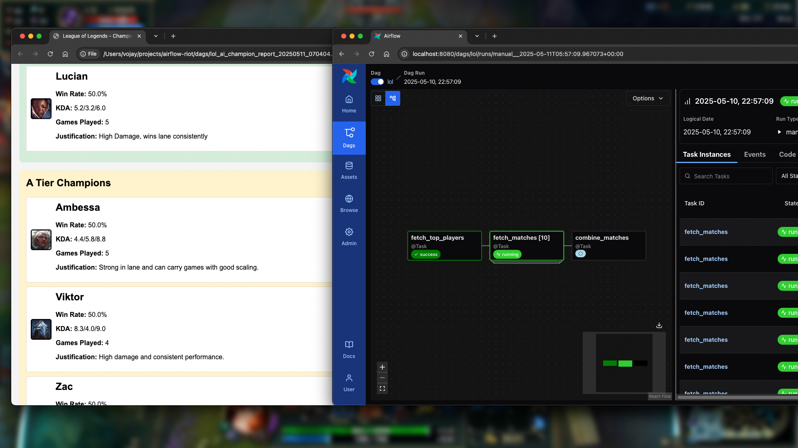

# Airflow 3 and Airflow AI SDK League of Legends Pipeline

This project demonstrates an end-to-end data pipeline built with Apache Airflow 3 and the Airflow AI SDK. It extracts
League of Legends match data from the Riot Games API, processes it using modern Airflow features, and leverages
Google's Gemini AI model to generate a champion performance tier list report.

## ✨ Core Concepts Demonstrated

* **Apache Airflow 3:** Utilizing new features and architecture.
  * TaskFlow API for Python-native DAG authoring.
  * Dynamic Task Mapping for parallel processing.
  * Dataset-driven scheduling concepts (mentioned in article context).
  * New UI elements and DAG Versioning.
  * `MultipleCronTriggerTimetable` for flexible scheduling.
* **Airflow AI SDK:** Seamless integration of Large Language Models (LLMs) into Airflow DAGs.
  * Using `@task.llm` with Google's Gemini Flash model.
  * AI-driven report generation (HTML).
* **Riot Games API Integration:**
  * Asynchronous Python client (`riot.py`) using `httpx` and Pydantic for data fetching and validation.
  * Handling API rate limits.
* **Modern Data Engineering Practices:**
  * Separation of concerns (API client vs. DAG logic).
  * Type safety with Pydantic.
  * Secure credential management with Airflow Variables and environment variables.

## 📋 Prerequisites

* **Astro CLI:** Install via `brew install astro` (or other methods from [Astro CLI documentation](https://www.astronomer.io/docs/astro/cli/overview/)).
* **Docker Desktop** or a Docker-compatible environment (like Rancher Desktop).
* **Riot Games API Key:** Obtain from the [Riot Games Developer Portal](https://developer.riotgames.com/).
* **Google Gemini API Key:** Obtain from [Google AI Studio](https://aistudio.google.com/apikey).
